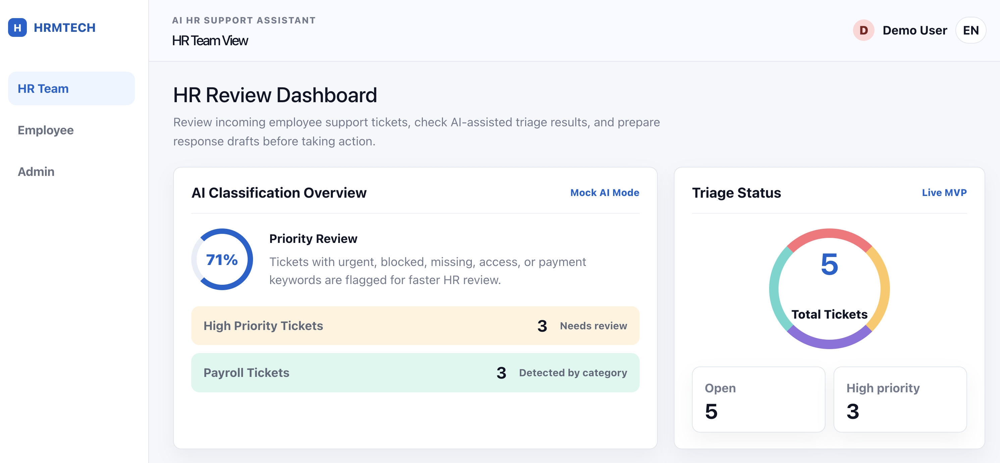
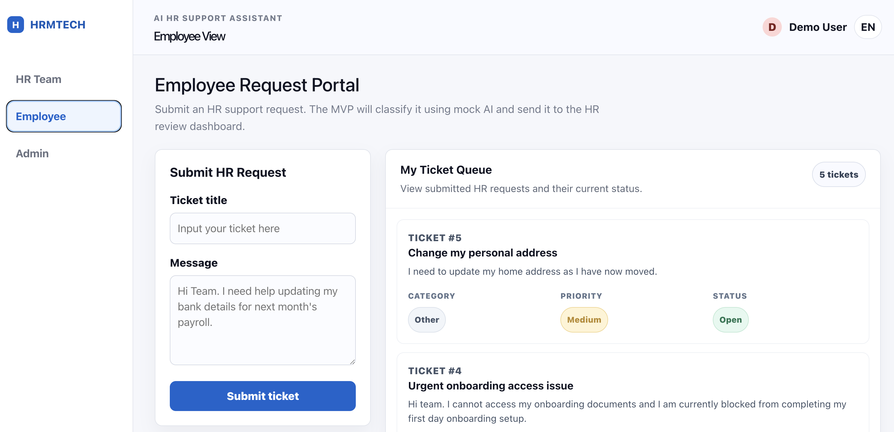
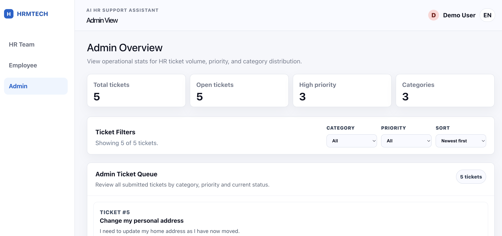
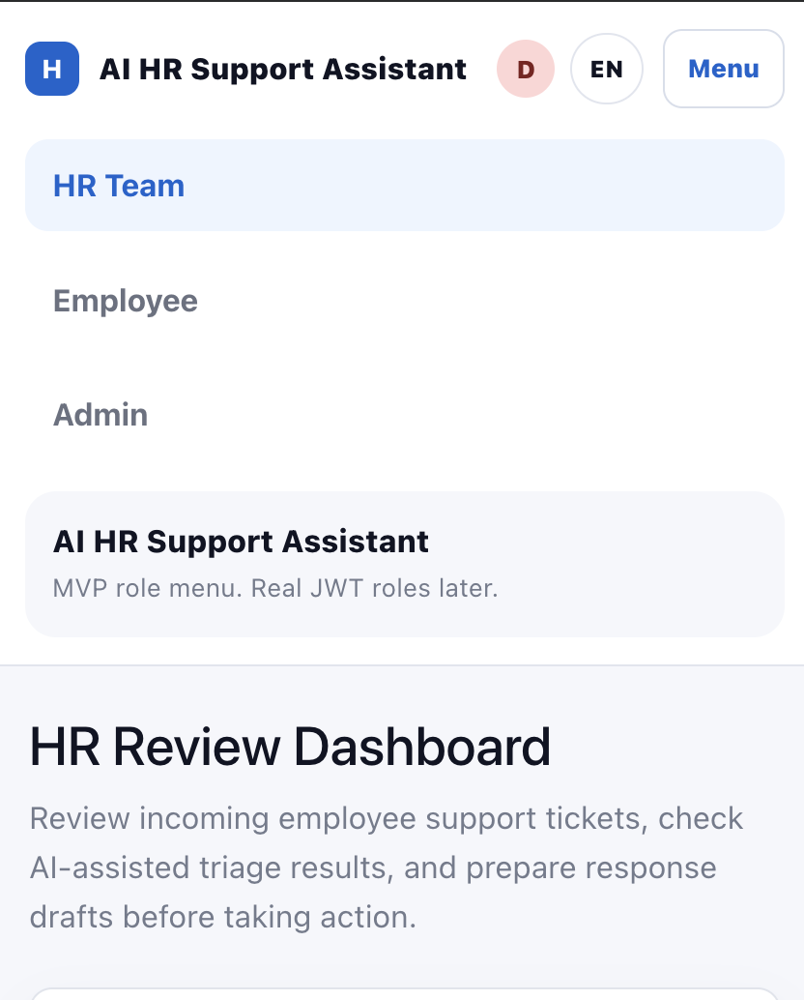

# AI HR Support Assistant

A full-stack AI-assisted HR support dashboard built with React, TypeScript, FastAPI, SQLAlchemy, and a local SQLite database for MVP development.

This project simulates an internal HR support tool where employees can submit HR requests, HR team members can review AI-assisted ticket triage, and admins can view ticket overview data.

The current version uses **mock AI classification** to categorise tickets, assign priority, generate suggested HR response drafts, and provide internal AI notes for HR review.

## Project Status

**Current stage:** Portfolio-ready MVP

✅ FastAPI backend  
✅ PostgreSQL database  
✅ Docker Compose PostgreSQL setup  
✅ Alembic database migrations  
✅ SQLAlchemy ticket model  
✅ React + TypeScript frontend  
✅ Employee / HR Team / Admin demo views  
✅ Mock AI ticket classification  
✅ AI Review Queue  
✅ Admin dashboard  
✅ Ticket status lifecycle: Open, In Progress, Resolved, Closed  
✅ HR/Admin status update workflow  
✅ Frontend filtering and sorting  
✅ Responsive mobile layout  
✅ GitHub screenshots  

### Screenshots

<table>
  <tr>
    <td>
      
      <br/>
      <strong>HR Team Dashboard</strong>
    </td>
    <td>
      
      <br/>
      <strong>Employee Dashboard</strong>
    </td>
  </tr>
  <tr>
    <td>
      
      <br/>
      <strong>Admin Dashboard</strong>
    </td>
    <td>
      
      <br/>
      <strong>Safari Mobile Menu</strong>
    </td>
  </tr>
</table>

## Key Features

**Employee View**
Employees can submit HR support requests through a simple request form.
After submission, the backend stores the ticket and applies mock AI classification.

**HR Team View**
HR team members can review submitted tickets and AI-assisted triage results.

**Admin View**

Admins can view operational ticket stats and filter the admin ticket queue.


## Mock AI Classification

The MVP uses deterministic mock AI logic instead of a real LLM API.
This makes the project easier to run locally because it does not require:

* API keys
* paid AI access
* external AI service setup
* network calls to an LLM provider

Example classification behaviour:
```text
Message contains “pay”, “salary”, “bank”, “wage”, or “payroll”
Category: Payroll
```

```text
Message contains “urgent”, “blocked”, “missing”, “cannot access”, or “not paid”
Priority: High
```

The AI output includes:

```text
category
priority
suggested_response
classification_reasoning
```

## Tech Stack

**Frontend**

* React
* TypeScript
* Vite
* CSS
* Responsive dashboard layout

**Backend**

* Python
* FastAPI
* SQLAlchemy
* SQLite for MVP development
* Pydantic schemas

**Development Tools**

* Git
* GitHub
* VS Code
* Local frontend/backend development servers

## Running Locally
Clone the repository:
```bash
git clone https://github.com/Iris408/ai-hr-support-assistant.git
cd ai-hr-support-assistant
```

### Backend Setup
Go into the backend folder:
```bash
cd backend
```

Create and activate a virtual environment:
```bash
python3 -m venv .venv
source .venv/bin/activate
```

Install dependencies and run the FastAPI backend:
```bash
pip install -r requirements.txt
uvicorn app.main:app --reload
```

Backend runs at:
```text
http://127.0.0.1:8000
```

Swagger Docs:
```text
http://127.0.0.1:8000/docs
```

### Frontend Setup
Open a second terminal and go into the frontend folder:
```bash
cd frontend
```

Install dependencies and run the frontend:
```bash
npm install
npm run dev
```

Frontend runs at:
```text
http://localhost:5173
```

### Current MVP Limitations

The current Employee / HR Team / Admin views are demo views. In a future version, these will be connected to real JWT authentication and role-based access control.

## Future Improvements

- JWT authentication and role-based access control
- Real user accounts for Employee, HR Team, and Admin users
- Backend analytics endpoint for dashboard stats
- Separate filters for AI Review Queue and Ticket Queue
- Improved Triage Status progress-bar design
- BackgroundTasks for AI classification
- Structured LLM output validation with Pydantic
- Optional real LLM integration with mock fallback mode
- Pytest backend tests
- GitHub Actions CI/CD
- Deployment to Render, Fly.io, or Railway

## Important Note

This project uses mock/demo HR data only.

It is not intended to process real employee data, private HR information, medical information, payroll records, or sensitive workplace information in its current MVP state.

AI outputs are shown as draft suggestions for HR review, not automatic decisions.

## Author
Built by Iris408